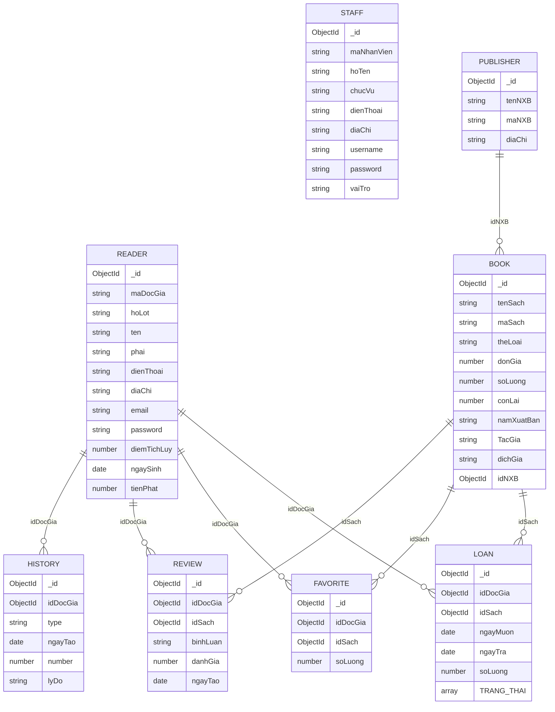

# E-Lib System Architecture Context

## 1) ERD Diagram



## 2) Component Diagram (Vue.js <-> Express)

```mermaid
flowchart LR
    U[Reader / Staff / Admin]

    subgraph FE[Vue Frontend - E-Lib_FrontEnd]
        R[Vue Router\nclient + admin routes]
        CV[Client Views\nBookList, Detail, Favorite, UserInfo]
        AV[AdminHomePage\n[Chưa phát triển]]
        LF[LoginForm/RegisterForm]
        SVC[BaseService + domain services\nbook/favorite/publisher/user/account]
        AX1[Axios instance\nsrc/api/axios.js]
        AX2[Axios clients\nsrc/services/api.service.js]
        LS[localStorage token]
    end

    subgraph BE[Express Backend - E-Lib_BackEnd]
        APP[app.js + routes.js]
        RT[Route modules\n/login /register\n/api/books /api/borrowings\n/api/favorites /api/readers /api/staffs]
        CTL[Controllers]
        SRV[Services]
        MDL[Mongoose Models]
        AUTH[auth middleware\nBearer JWT]
    end

    DB[(MongoDB)]

    U --> R
    R --> CV
    R --> AV
    R --> LF

    CV --> SVC
    SVC --> AX2

    LF --> AX1
    AX1 --> LS

    AX1 -->|HTTP JSON + Authorization Bearer| APP
    AX2 -->|HTTP JSON| APP

    APP --> RT
    RT --> CTL
    CTL --> SRV
    CTL --> AUTH
    SRV --> MDL
    MDL --> DB
```

## 3) Directory Structure (Workspace)

```mermaid
flowchart TD
    WS[Workspace]

    WS --> A[B2303832_Tran_Van_Nghia_BackEnd02\nExpress contact sample project]
    WS --> B[CTULib\nLibrary system (Backend + Frontend)]
    WS --> C[E-Lib_FrontEnd\nVue client/admin UI]
    WS --> D[E-Lib_BackEnd\nExpress + MongoDB API]

    A --> A1[app/controllers routes services config]
    B --> B1[Backend/src + Frontend/src]

    C --> C1[src/router\nroute map client/admin]
    C --> C2[src/services + src/api\nHTTP client layer]
    C --> C3[src/views + src/components\nUI pages/components]
    C --> C4[theme_files\nstatic theme drafts]

    D --> D1[app/router\nAPI entrypoints]
    D --> D2[app/controller\nrequest handlers]
    D --> D3[app/service\nbusiness/data access]
    D --> D4[app/model\nMongoose schemas]
    D --> D5[app/middleware\nJWT auth]
    D --> D6[db\nseed/reference scripts]
```
