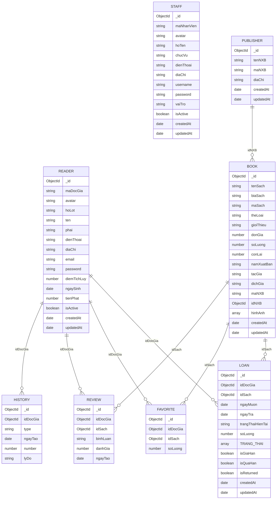
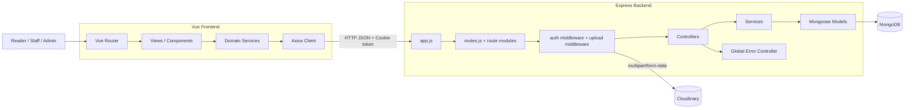

# E-Lib Backend Architecture Context (Updated from Source Code)

Tai lieu nay duoc cap nhat truc tiep tu ma nguon trong `E-Lib_BackEnd` de FE co the tich hop chinh xac va on dinh.

## 1) Domain Model (ERD)

## 2) Runtime Architecture (Vue <-> Express <-> MongoDB)

## 3) Entry Points, Config, and Policies

### 3.1 App entrypoints

- `server.js`: connect MongoDB, start server.
- `app.js`: setup middleware (`express.json`, `cors`, `cookie-parser`), mount routes, global error handler.
- `app/router/routes.js`: mount all API groups.

### 3.2 Environment/config

- `.env` duoc nap trong `app/config/index.js`.
- Bien quan trong:
  - `PORT`
  - `MONGODB_URI`
  - `JWT_SECRET`
  - `CLOUDINARY_CLOUD_NAME`, `CLOUDINARY_API_KEY`, `CLOUDINARY_API_SECRET`

### 3.3 CORS and cookie policy (quan trong voi FE)

- CORS hien tai cho phep duy nhat origin: `http://localhost:3001`.
- `credentials: true` dang bat.
- Token dang duoc luu qua cookie `token` (HttpOnly), khong phai chuan Bearer header.

Chinh sach FE can ap dung:

- Tat ca request can auth phai gui `withCredentials: true`.
- Neu FE chay khac host/port voi CORS config hien tai, backend phai cap nhat `origin`.

## 4) Authentication and Authorization Contract

### 4.1 Login/logout/me

- `POST /api/login`
  - body: `{ username, password }`
  - success: set cookie `token`, tra ve `{ user, token, message }`
- `POST /api/login/logout`
  - clear cookie `token`
- `GET /api/me`
  - yeu cau cookie hop le
  - tra ve `{ user: { id, role } }`

### 4.2 Role model dang dung trong code

- Reader: `role = ""` (chuoi rong)
- Staff/Admin: `role = user.vaiTro` (`admin` hoac `staff`)

Luu y thuc te:

- Mot so middleware role dang check chuoi `"stuff"` thay vi `"staff"`.
- FE nen uu tien check role `admin` cho cac tinh nang quan tri nhay cam, va xem `staff` la role van hanh.

## 5) API Surface (Mounted Routes)

Base URL: `http://<host>:<port>`

### 5.1 Auth

- `POST /api/login`
- `POST /api/login/logout`
- `POST /api/register`
- `GET /api/me`

### 5.2 Books (`/api/books`)

- `GET /api/books`
  - query: `keyword`, `theLoai`, `tacGia`, `page`, `limit`
  - response:
    - `books`: danh sach sach
    - `publisherNames`: danh sach ten NXB
    - `types`: danh sach the loai
    - `authors`: danh sach tac gia
- `POST /api/books`
  - multipart/form-data, upload field `image` (toi da 5)
  - tao sach
- `GET /api/books/:id`
  - response: `{ book, relatedBooks }`
- `PATCH /api/books/:id`
  - multipart/form-data, upload field `image` (toi da 5)
- `DELETE /api/books/:id`

### 5.3 Borrow/Loan (`/api/borrow`)

- `GET /api/borrow` (can auth)
  - reader: lay loan theo chinh minh
  - admin/staff: lay tat ca
- `POST /api/borrow` (can auth + role reader)
  - body:
    - `idDocGia`: ObjectId
    - `idSach`: array ObjectId
  - rang buoc nghiep vu:
    - moi doc gia toi da 5 sach dang muon
    - co loan qua han thi khong duoc muon them
- `GET /api/borrow/:id`
- `PATCH /api/borrow/:id` (can auth + role admin/staff theo middleware)
- `DELETE /api/borrow/:id` (can auth + role reader)

### 5.4 Favorites (`/api/favorites`)

Toan bo route yeu cau auth + reader middleware:

- `GET /api/favorites`
  - lay theo `idDocGia` tu query hoac body
- `POST /api/favorites`
  - body: `{ idDocGia, idSach }`
- `PATCH /api/favorites`
  - body: `{ idDocGia, idSach, soLuong }`
- `DELETE /api/favorites`
  - body: `{ idDocGia, idSach }`

### 5.5 Readers (`/api/readers`)

- `GET /api/readers`
- `GET /api/readers/:id`
- `POST /api/readers`
- `PATCH /api/readers/:id`
- `PATCH /api/readers/:id/change-password`
  - body: `{ currentPass, newPass }`
- `PATCH /api/readers/:id/block`
  - body can thong tin xac thuc staff: `{ staff: { _id, password }, isActive }`
- `DELETE /api/readers/:id`
- `POST /api/readers/:id/history`
  - body: `{ type: point|day|money, number, lyDo }`

### 5.6 Staffs (`/api/staffs`)

- `GET /api/staffs`
- `POST /api/staffs`
- `GET /api/staffs/:id`
- `PATCH /api/staffs/:id`
- `DELETE /api/staffs/:id`
- `PATCH /api/staffs/:id/active`
  - body: `{ staff: { _id, password } }`

### 5.7 Publishers (`/api/publishers`)

- `GET /api/publishers`
- `POST /api/publishers`
- `GET /api/publishers/:id`
- `PUT /api/publishers/:id`

## 6) Response/Error Conventions for FE

Codebase hien tai chua dong nhat 100% response schema. FE nen xu ly theo nguyen tac sau:

- Auth/login sai credentials co endpoint tra `200` voi message loi (khong phai 4xx).
- Nhieu endpoint thanh cong tra object data truc tiep, khong boc `data`.
- Global error handler trong production thuong tra:
  - `{ status, message }`
- Mot so controller bat loi cuc bo tra:
  - `{ message: "..." }`

Khuyen nghi adapter FE:

- Uu tien doc `message` neu co.
- Kiem tra du lieu chinh theo fallback keys: `data`, `books`, `readers`, `loans`, `favorites`, hoac object root.
- Xu ly 401/403 bang redirect login va clear state.

## 7) Data-level Business Rules FE Should Know

- Reader/Staff password duoc hash truoc khi luu (pre-save hook).
- Ma tu dong:
  - Reader: `DGxxxx`
  - Staff: `NVxxxx`
  - Publisher: `NXBxxxx`
- Review schema co unique index `(idDocGia, idSach)` (1 doc gia danh gia 1 sach toi da 1 lan).
- Loan co cac co trang thai va flag: `trangThaiHienTai`, `TRANG_THAI`, `isQuaHan`, `isReturned`.
- Upload anh sach di qua Cloudinary middleware, folder theo `elib_books/<maSach>`.

## 8) Gap Notes (Code vs Architecture)

Nhung diem nay can FE biet de tranh hieu sai context:

- Co `review.controller.js` + `review.service.js` + model, nhung chua duoc mount route trong `routes.js`.
- `deletePublisher` co controller/service nhung route publisher chua expose endpoint `DELETE`.
- Auth middleware role check co typo `stuff`/`staff`.
- `reader.service.updateReader` dang khong tra `new: true`, nen response update co the la ban ghi truoc cap nhat.
- `book.service.getAllBooks` dang loc `TacGia` (chu hoa T) trong khi schema field la `tacGia`.

## 9) FE Integration Checklist

- Dat `withCredentials: true` trong Axios cho request can auth.
- Dong bo CORS origin voi domain FE thuc te.
- Dung route map trong Muc 5 lam source of truth.
- Chuan hoa parser response tai FE service layer de chiu duoc response khong dong nhat.
- Xu ly message tieng Viet tu backend de hien thi thong bao dung ngu canh.
