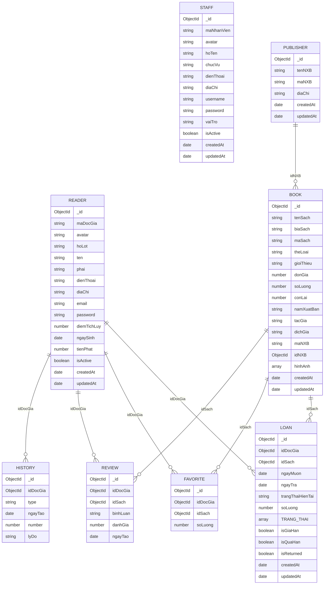
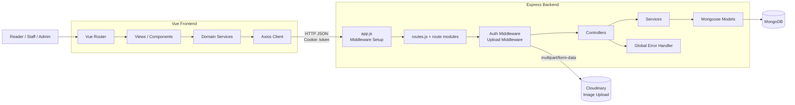

# E-Lib Backend Architecture Context

Document này được cập nhật trực tiếp từ mã nguồn trong `E-Lib_BackEnd`. Dùng làm tài liệu tích hợp chính xác cho Frontend.

## 1) Domain Model (ERD)



## 2) Project Structure (Backend)

```
E-Lib_BackEnd/
├── server.js                 # Entry point, DB connection
├── app.js                    # Express app setup, middleware config
├── package.json              # Dependencies (Express, Mongoose, JWT, etc.)
└── app/
    ├── config/
    │   └── index.js          # Environment config loader
    ├── controller/           # Request handlers, business logic coordination
    │   ├── book.controller.js
    │   ├── error.controller.js
    │   ├── favorite.controller.js
    │   ├── history.controller.js
    │   ├── loan.controller.js
    │   ├── login.controller.js
    │   ├── publisher.controller.js
    │   ├── reader.controller.js
    │   ├── review.controller.js
    │   └── staff.controller.js
    ├── middleware/           # Auth, upload processing
    │   ├── auth.middleware.js  # JWT token verification
    │   └── upload.js           # Cloudinary multipart/form-data processing
    ├── model/               # Mongoose schemas + models
    │   ├── Book.js
    │   ├── Favorite.js
    │   ├── History.js
    │   ├── Loan.js
    │   ├── Publisher.js
    │   ├── Reader.js
    │   ├── Review.js
    │   └── Staff.js
    ├── router/              # Route definitions + mounting
    │   ├── routes.js           # Main router, mounts all route modules
    │   ├── book.route.js
    │   ├── borrow.route.js
    │   ├── favorite.route.js
    │   ├── login.route.js
    │   ├── publisher.route.js
    │   ├── reader.route.js
    │   ├── register.route.js
    │   ├── review.route.js
    │   └── staff.route.js
    ├── service/             # Business logic, database queries
    │   ├── book.service.js
    │   ├── favorite.service.js
    │   ├── history.service.js
    │   ├── loan.service.js
    │   ├── publisher.service.js
    │   ├── reader.service.js
    │   ├── review.service.js
    │   └── staff.service.js
    └── utils/               # Utilities
        ├── ApiError.js         # Custom error class
        └── mongodb.util.js     # MongoDB connection utility
```

## 3) Runtime Architecture (Vue <-> Express <-> MongoDB)



## 4) Entry Points, Config, and Policies

### 4.1 Application Entry Points

- **`server.js`**: Khởi động server, kết nối MongoDB, lắng nghe port
- **`app.js`**: Cấu hình Express app, middleware, mounted routes, error handler
- **`app/router/routes.js`**: Mount tất cả API route groups

### 4.2 Middleware Stack (app.js)

```javascript
// Thứ tự xử lý:
1. express.json()           // Parse request body
2. cors({ origin: "http://localhost:3001", credentials: true })
3. cookieParser()           // Parse cookies (HttpOnly token)
4. routes(app)              // API routing
5. Global error handler     // Catch-all error handler
```

**QUAN TRỌNG cho FE**:

- CORS hiện chỉ cho phép origin `http://localhost:3001`
- Nếu FE chạy ở host/port khác, phải cập nhật `origin` trong CORS config
- Token được lưu ở cookie HttpOnly (tên: `token`), không phải Bearer header

### 4.3 Configuration Management

Biến môi trường được load từ `.env` (qua `app/config/index.js`):

```env
PORT=3000
MONGODB_URI=mongodb://...
JWT_SECRET=your-secret-key
JWT_EXPIRES_IN=7d

CLOUDINARY_CLOUD_NAME=...
CLOUDINARY_API_KEY=...
CLOUDINARY_API_SECRET=...

NODE_ENV=development
```

### 4.4 Dependencies (package.json)

**Core Framework**:

- `express@5.2.1` - Web framework
- `mongoose@9.3.3` - MongoDB ODM

**Authentication & Security**:

- `jsonwebtoken@9.0.3` - JWT token generation/verification
- `bcryptjs@3.0.3` - Password hashing
- `cookie-parser@1.4.7` - Cookie parsing

**File Upload**:

- `multer@2.1.1` - Multipart form-data processing
- `cloudinary@2.9.0` - Cloud image storage
- `multer-storage-cloudinary@2.2.1` - Multer integration

**Utilities**:

- `dotenv@17.3.1` - Environment variables
- `cors@2.8.6` - Cross-origin requests
- `node-cron@4.2.1` - Scheduled tasks

## 5) Authentication & Authorization Contract

### 5.1 Login / Register / Logout

**POST `/api/login`**

```
Request:  { username, password }
Response: { success: true, user: { _id, maNhanVien, vaiTro }, token, message }
          or { success: false, message } (non-200 status)
Cookies:  Set token (HttpOnly)
```

**POST `/api/register`**

```
Request:  { hoTen, email, password, confirmPassword }
Response: { success: true, data: newReader, message }
```

**POST `/api/login/logout`**

```
Response: { success: true, message }
Cookies:  Clear token
```

**GET `/api/me` (requires valid token cookie)**

```
Response: { user: { _id, email, vaiTro } }
Status:   401 if token invalid/expired
```

### 5.2 Role Model & Authorization

**Roles**:

- `reader` (role = "" / empty string) - Độc giả bình thường
- `staff` (role = "staff") - Nhân viên thư viện
- `admin` (role = "admin") - Quản trị viên

**Middleware Usage**:

- `verifyToken` - Kiểm tra JWT hợp lệ
- Route-specific role checks (admin-only, staff-only, reader-only)

⚠️ **Known Issue**: Một số middleware check typo `"stuff"` thay vì `"staff"`

## 6) Complete API Routes Reference

Base URL: `http://<host>:<port>`

### 6.1 Authentication Routes (`/api/`)

```
POST   /api/login              # Đăng nhập
POST   /api/login/logout       # Đăng xuất (xóa cookie)
POST   /api/register           # Đăng ký độc giả mới
GET    /api/me                 # Lấy thông tin user hiện tại (require auth)
```

### 6.2 Books Management (`/api/books`)

```
GET    /api/books              # Danh sách sách (có filter)
POST   /api/books              # Thêm sách (require auth + admin)
GET    /api/books/:id          # Chi tiết sách + sách liên quan
PATCH  /api/books/:id          # Cập nhật sách (require auth + admin)
DELETE /api/books/:id          # Xóa sách (require auth + admin)
```

**Query parameters (GET /api/books)**:

- `keyword` - Tìm kiếm theo tên/tác giả
- `theLoai` - Lọc theo thể loại
- `tacGia` - Lọc theo tác giả
- `page` - Trang (default: 1)
- `limit` - Số sách/trang (default: 12)

**Response**:

```json
{
  "books": [...],
  "publisherNames": [...],
  "types": [...],
  "authors": [...]
}
```

### 6.3 Borrowing/Loans (`/api/borrow`)

```
GET    /api/borrow             # Danh sách phiếu mượn (require auth)
POST   /api/borrow             # Tạo phiếu mượn (require auth + reader)
GET    /api/borrow/:id         # Chi tiết phiếu mượn
PATCH  /api/borrow/:id         # Cập nhật phiếu (admin/staff)
DELETE /api/borrow/:id         # Xóa phiếu (require auth + reader)
```

**Business Rules**:

- Mỗi độc giả tối đa 5 sách đang mượn
- Không được mượn thêm nếu có phiếu quá hạn

### 6.4 Favorites (`/api/favorites`)

```
GET    /api/favorites          # Danh sách yêu thích (require auth + reader)
POST   /api/favorites          # Thêm vào yêu thích
PATCH  /api/favorites          # Cập nhật số lượng
DELETE /api/favorites          # Xóa khỏi yêu thích
```

**Body**:

```json
{
  "idDocGia": "ObjectId",
  "idSach": "ObjectId"
}
```

### 6.5 Readers Management (`/api/readers`)

```
GET    /api/readers            # Danh sách độc giả (require auth + admin)
GET    /api/readers/:id        # Chi tiết độc giả
POST   /api/readers            # Tạo độc giả mới
PATCH  /api/readers/:id        # Cập nhật thông tin (require auth)
PATCH  /api/readers/:id/change-password    # Đổi mật khẩu
PATCH  /api/readers/:id/block               # Khóa/mở khóa độc giả
DELETE /api/readers/:id        # Xóa độc giả
POST   /api/readers/:id/history             # Ghi lịch sử (điểm, tiền phạt, ngày)
```

### 6.6 Staff Management (`/api/staffs`)

```
GET    /api/staffs             # Danh sách nhân viên (require auth + admin)
POST   /api/staffs             # Tạo nhân viên
GET    /api/staffs/:id         # Chi tiết nhân viên
PATCH  /api/staffs/:id         # Cập nhật thông tin
DELETE /api/staffs/:id         # Xóa nhân viên
PATCH  /api/staffs/:id/active  # Kích hoạt/vô hiệu hóa
```

### 6.7 Publishers Management (`/api/publishers`)

```
GET    /api/publishers         # Danh sách nhà xuất bản
POST   /api/publishers         # Thêm nhà xuất bản
GET    /api/publishers/:id     # Chi tiết nhà xuất bản
PUT    /api/publishers/:id     # Cập nhật nhà xuất bản
```

### 6.8 Reviews (`/api/reviews`)

⚠️ **Status**: Route chưa được mount trong `routes.js`

```
GET    /api/reviews            # Danh sách đánh giá sách
POST   /api/reviews            # Thêm đánh giá (require auth + reader)
PATCH  /api/reviews/:id        # Cập nhật đánh giá
DELETE /api/reviews/:id        # Xóa đánh giá
```

## 7) Response & Error Handling Conventions

### 7.1 Success Response Formats

Backend không hoàn toàn đồng nhất. Frontend nên xử lý:

```javascript
// Format 1: Direct data return
{ success: true, message: "...", data: {...} }

// Format 2: Object root
{ success: true, message: "...", books: [...] }

// Format 3: Direct object
{ id: "...", tenSach: "...", ... }
```

### 7.2 Error Response Formats

```javascript
// Format 1: Global error handler
{ status: "fail", message: "..." }

// Format 2: Controller catch
{ message: "..." }

// Format 3: Validation error
{ success: false, message: "..." }
```

### 7.3 HTTP Status Codes

- `200` - Success (including login failures with message)
- `201` - Created
- `400` - Bad request / Validation error
- `401` - Unauthorized (missing/invalid token)
- `403` - Forbidden (insufficient permissions)
- `404` - Not found
- `500` - Server error

### 7.4 Frontend Adapter Recommendations

```javascript
// Standardize response parsing
async function parseResponse(response) {
  const data = response.data;

  // Priority order for message
  const message = data.message || data.errors?.[0]?.message;

  // Priority order for actual data
  const payload =
    data.data || data.books || data.readers || data.loans || data || {};

  return { message, payload, ...data };
}

// Handle auth errors
if (response.status === 401) {
  clearAuthState();
  router.push("/login");
}
```

## 8) Data Models & Business Rules

### 8.1 Auto-Generated IDs

- **Reader**: `DGxxxx` (Độc Giả)
- **Staff**: `NVxxxx` (Nhân Viên)
- **Publisher**: `NXBxxxx` (Nhà Xuất Bản)
- **Book**: `Sxxxx` (Sách)

### 8.2 Key Constraints

- **Reader** password: Pre-hashed (bcrypt) before save
- **Staff** password: Pre-hashed (bcrypt) before save
- **Review**: Unique constraint on `(idDocGia, idSach)` - 1 độc giả chỉ đánh giá 1 sách một lần
- **Favorite**: Unique constraint on `(idDocGia, idSach)`

### 8.3 Loan States

```javascript
{
  trangThaiHienTai: String,      // Current state
  TRANG_THAI: Array,              // State history
  isGiaHan: Boolean,              // Extended flag
  isQuaHan: Boolean,              // Overdue flag
  isReturned: Boolean             // Returned flag
}
```

### 8.4 File Upload

- **Destination**: Cloudinary (cloud storage)
- **Folder Structure**: `elib_books/<maSach>/`
- **Max Files**: 5 per request
- **Supported Fields**: `biaSach` (cover), `hinhAnh` (multiple images)

## 9) Known Issues & Gaps

### 9.1 Incomplete Features

- ❌ Reviews API: Routes không được mount trong `routes.js`
- ❌ Delete Publisher: Controller/service tồn tại nhưng route không expose

### 9.2 Code Inconsistencies

- ⚠️ Auth middleware: Role check có typo `"stuff"` vs `"staff"`
- ⚠️ Reader.updateReader(): Không trả `new: true`, response có thể là dữ liệu cũ
- ⚠️ Book.getAllBooks(): Filter `TacGia` (uppercase) nhưng schema là `tacGia`
- ⚠️ Response schema chưa hoàn toàn đồng nhất giữa các endpoint

### 9.3 Recommendations

1. **Standardize responses**: Tất cả endpoint nên trả `{ success, message, data }`
2. **Fix typos**: `stuff` → `staff` trong middleware
3. **Complete features**: Mount review routes, add delete publisher
4. **Add validation**: Rõ ràng hơn trong schema/controller
5. **Document errors**: API error codes and meanings

## 10) Frontend Integration Checklist

- [ ] Set `withCredentials: true` trong Axios config cho mọi request có auth
- [ ] Đồng bộ CORS `origin` với domain FE thực tế (không phải localhost:3001)
- [ ] Implement response parser để xử lý response không đồng nhất
- [ ] Handle 401 errors: redirect đến login, clear auth state
- [ ] Display Vietnamese messages từ backend thông báo
- [ ] Test borrow business rule: max 5 sách, không mượn khi quá hạn
- [ ] Test file upload: Verify Cloudinary integration
- [ ] Test pagination: `page` và `limit` query params
- [ ] Handle soft delete: Kiểm tra `isActive` flag trong response
- [ ] Role-based rendering: Check `user.vaiTro` cho admin/staff features
