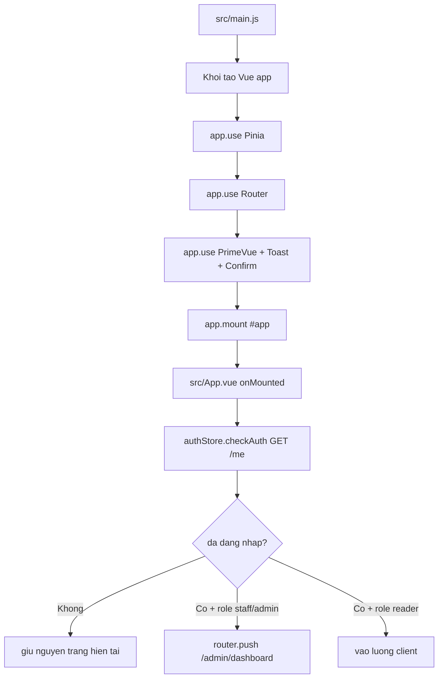

# E-Lib FrontEnd Architecture Context

Muc tieu tai lieu nay: cung cap du ngu canh de hieu cau truc va quan he giua cac phan trong FrontEnd ma khong can quet lai toan bo thu muc src.

## 1) Snapshot kien truc

- Stack: Vue 3 + Vite + Vue Router + Pinia + PrimeVue + TailwindCSS + Axios + VeeValidate/Yup.
- Kieu to chuc: route-level view trong src/views, UI tai su dung trong src/components, state auth trong src/stores, HTTP gateway tap trung o src/api/axios.js.
- FrontEnd hien tai goi truc tiep API qua axios (khong co lop src/services). Moi tai lieu cu tham chieu src/services la da loi thoi.

## 2) Runtime flow (tu luc app start)



Ghi chu:

- checkAuth nam trong src/stores/auth.store.js va dung axios instance co withCredentials.
- Co che auth hien tai dua vao cookie/session backend + du lieu user trong Pinia store.

## 3) Router map

Router duoc khai bao tai src/router/index.js.

### Nhom client

- / -> src/views/client/ClientLayout.vue (layout chua Header/Footer + router-view con)
- /books -> BookListPage
- /books/:id -> BookDetailPage
- /favorite -> BookFavoritePage
- /borrow-history -> BorrowHistoryPage
- /readers/:id -> UserInforPage

### Nhom auth

- /login -> src/views/Login.vue (render LoginForm)
- /register -> src/views/Login.vue (render RegistorForm)

### Nhom admin

- /admin/dashboard -> src/views/admin/DashBoard.vue

### Not found

- /:pathMatch(._)_ -> src/views/NotFoundPage.vue

## 4) Phan lop module trong src

```text
src/
    main.js                 # bootstrap app + plugin registration
    App.vue                 # root shell, check auth on mount
    api/
        axios.js              # HTTP client duy nhat (baseURL + withCredentials)
    router/
        index.js              # route definition
    stores/
        auth.store.js         # user state, checkAuth, logout, role computed
    views/
        client/*              # route-level pages cho doc gia
        admin/*               # route-level page cho staff/admin
        Login.vue             # wrapper form dang nhap/dang ky
    components/
        Header/Footer/...     # UI tai su dung
        admin/*               # cac module quan tri hien thi trong DashBoard
        login/*               # LoginForm, RegistorForm
        user-infor/*          # thong tin ca nhan, tai khoan, lich su
    utils/
        useAppToast.js        # helper toast PrimeVue
        useConfirm.js         # helper confirm PrimeVue
```

## 5) Quan he giua cac module

```mermaid
flowchart LR
    R[Router] --> VC[Views Client]
    R --> VA[Views Admin]
    R --> VL[View Login]

    VC --> C[Reusable Components]
    VA --> CA[Admin Components]
    VL --> CL[Login/Register Components]

    VC --> AX[src/api/axios.js]
    VA --> AX
    CL --> AX
    U[user-infor components] --> AX

    APP[App.vue] --> S[auth.store.js]
    H[Header/UserInforSideBar] --> S
    D[DashBoard.vue] --> S
    S --> AX
    AX --> BE[/Backend API /api/*]
```

## 6) Luong nghiep vu chinh

### 6.1 Dang nhap / Dang ky / Dang xuat

- LoginForm POST /login.
- Thanh cong: decode token, setUser vao auth store, dieu huong theo role (admin/staff vao dashboard, reader ve /).
- RegistorForm POST /register, thanh cong thi chuyen /login.
- Logout qua authStore.logout -> POST /login/logout, xoa user trong store.

### 6.2 Duyet sach va loc sach

- BookListPage GET /books.
- BookFilter phat su kien filter theo theLoai, tacGia, nhaXuatBan.
- BookList render danh sach qua BookCard (link den /books/:id).

### 6.3 Chi tiet sach va muon sach

- BookDetailPage GET /books/:id de lay chi tiet + relatedBooks.
- Them yeu thich: POST /favorites.
- Muon ngay: POST /borrow voi idSach.

### 6.4 Danh sach yeu thich

- BookFavoritePage GET /favorites theo idDocGia.
- Xoa yeu thich: DELETE /favorites.
- Muon nhieu sach: POST /borrow voi danh sach idSach da chon.

### 6.5 Lich su muon

- BorrowHistoryPage GET /borrow.
- BorrowCard hien thi trang thai muon; xoa yeu cau qua DELETE /borrow/:loanId.

### 6.6 Trang thong tin nguoi dung

- UserInforPage GET /readers/:id de lay profile.
- UserInfor PATCH /readers/:id cap nhat thong tin ca nhan.
- UserAccount PATCH /readers/:id/change-password doi mat khau.

### 6.7 Dashboard admin

- DashBoard la shell chuyen man hinh noi bo bang activeScreen.
- Các module quan tri:
  - ReadersManagement: GET /readers, POST /readers, PATCH /readers/:id, PATCH /readers/:id/block, POST /readers/:id/history.
  - StaffsManagement: GET /staffs, POST /staffs, PATCH /staffs/:id, PATCH /staffs/:id/active.
  - PublishersManagement: GET /publishers, POST /publishers, PUT /publishers/:id.
  - OverviewPanel: thong ke UI.
  - BooksManagement va LoansManagement: hien tai dang o muc mock/demo UI.

## 7) API matrix (frontend su dung hien tai)

| Nhom      | Endpoint                           | Noi goi chinh                                                               |
| --------- | ---------------------------------- | --------------------------------------------------------------------------- |
| Auth      | POST /login                        | components/login/LoginForm.vue                                              |
| Auth      | POST /register                     | components/login/RegistorForm.vue                                           |
| Auth      | GET /me                            | stores/auth.store.js                                                        |
| Auth      | POST /login/logout                 | stores/auth.store.js                                                        |
| Books     | GET /books                         | views/client/BookListPage.vue                                               |
| Books     | GET /books/:id                     | views/client/BookDetailPage.vue                                             |
| Favorites | GET /favorites                     | views/client/BookFavoritePage.vue                                           |
| Favorites | POST /favorites                    | views/client/BookDetailPage.vue                                             |
| Favorites | DELETE /favorites                  | views/client/BookFavoritePage.vue                                           |
| Borrow    | GET /borrow                        | views/client/BorrowHistoryPage.vue                                          |
| Borrow    | POST /borrow                       | views/client/BookDetailPage.vue, views/client/BookFavoritePage.vue          |
| Borrow    | DELETE /borrow/:id                 | views/client/BorrowHistoryPage.vue                                          |
| Reader    | GET /readers/:id                   | views/client/UserInforPage.vue                                              |
| Reader    | PATCH /readers/:id                 | components/user-infor/UserInfor.vue, components/admin/ReadersManagement.vue |
| Reader    | PATCH /readers/:id/change-password | components/user-infor/UserAccount.vue                                       |
| Reader    | GET /readers                       | components/admin/ReadersManagement.vue                                      |
| Reader    | POST /readers                      | components/admin/ReadersManagement.vue                                      |
| Reader    | PATCH /readers/:id/block           | components/admin/ReadersManagement.vue                                      |
| Reader    | POST /readers/:id/history          | components/admin/ReadersManagement.vue                                      |
| Staff     | GET /staffs                        | components/admin/StaffsManagement.vue                                       |
| Staff     | POST /staffs                       | components/admin/StaffsManagement.vue                                       |
| Staff     | PATCH /staffs/:id                  | components/admin/StaffsManagement.vue                                       |
| Staff     | PATCH /staffs/:id/active           | components/admin/StaffsManagement.vue                                       |
| Publisher | GET /publishers                    | components/admin/PublishersManagement.vue                                   |
| Publisher | POST /publishers                   | components/admin/PublishersManagement.vue                                   |
| Publisher | PUT /publishers/:id                | components/admin/PublishersManagement.vue                                   |

## 8) Quy uoc ky thuat dang ap dung

- Alias duong dan @ -> src (cau hinh trong vite.config.js).
- Dev server chay port 3001 va proxy /api -> http://localhost:3000.
- Axios baseURL uu tien VITE_HOST, fallback http://localhost:3000/api.
- Toast/confirm thong nhat qua useAppToast va useConfirm helper.
- Form validation su dung vee-validate + yup cho login/register va mot so form admin/user.

## 9) Diem can luu y khi mo rong

- Chua co route guard trung tam (hien tai dieu huong auth chu yeu o App.vue va tung component).
- BooksManagement va LoansManagement chua noi API that.
- Chua co tang service trung gian; views/components goi API truc tiep.

Neu can nang cap kien truc:

1. Them middleware guard theo role o router.
2. Tach API call sang domain service/composable de giam logic trong view.
3. Chuan hoa model du lieu tra ve tu backend (typing/interface).
